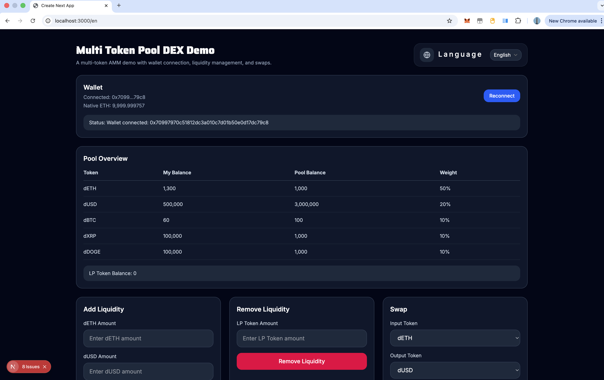
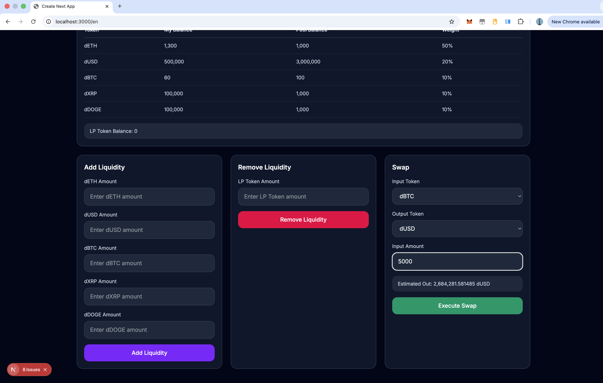
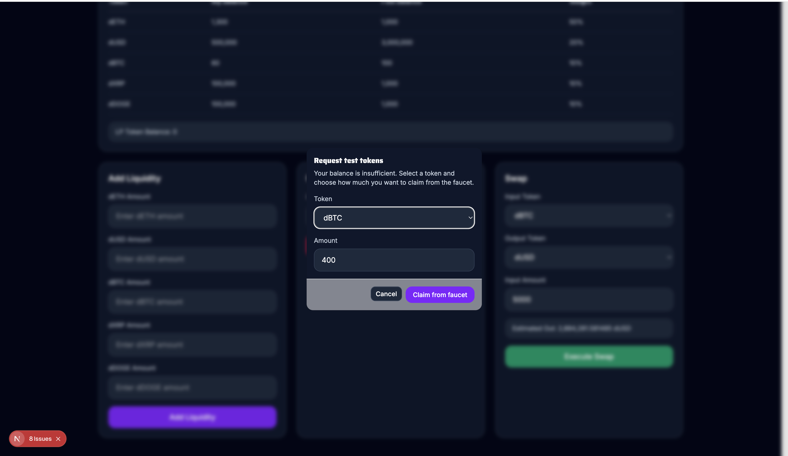
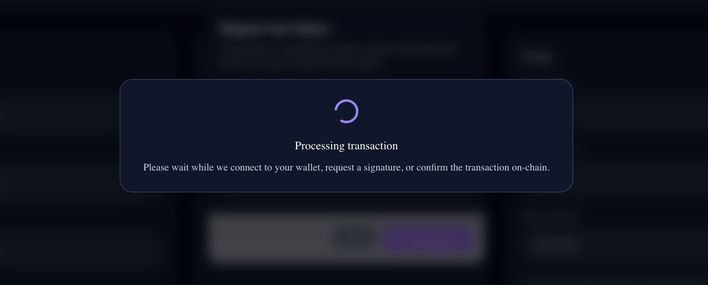
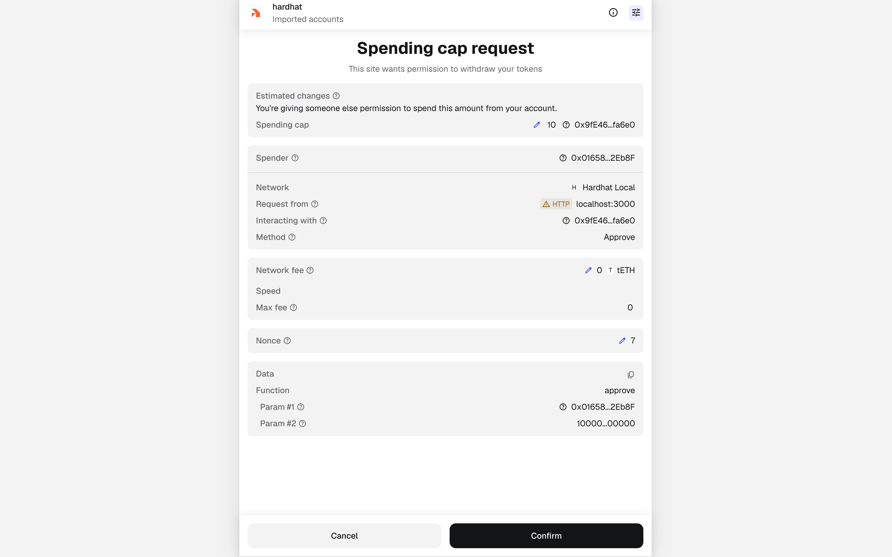
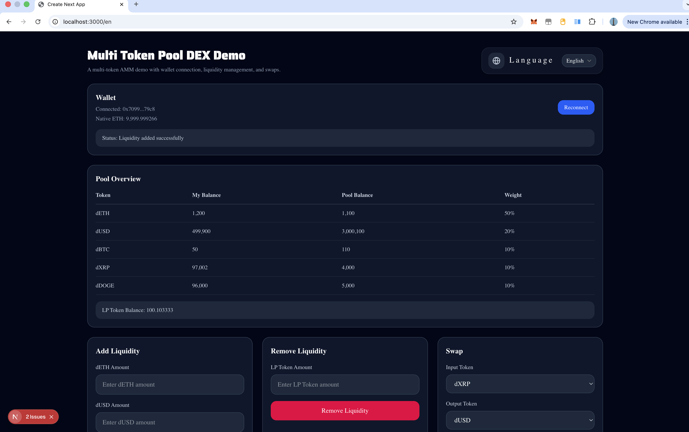
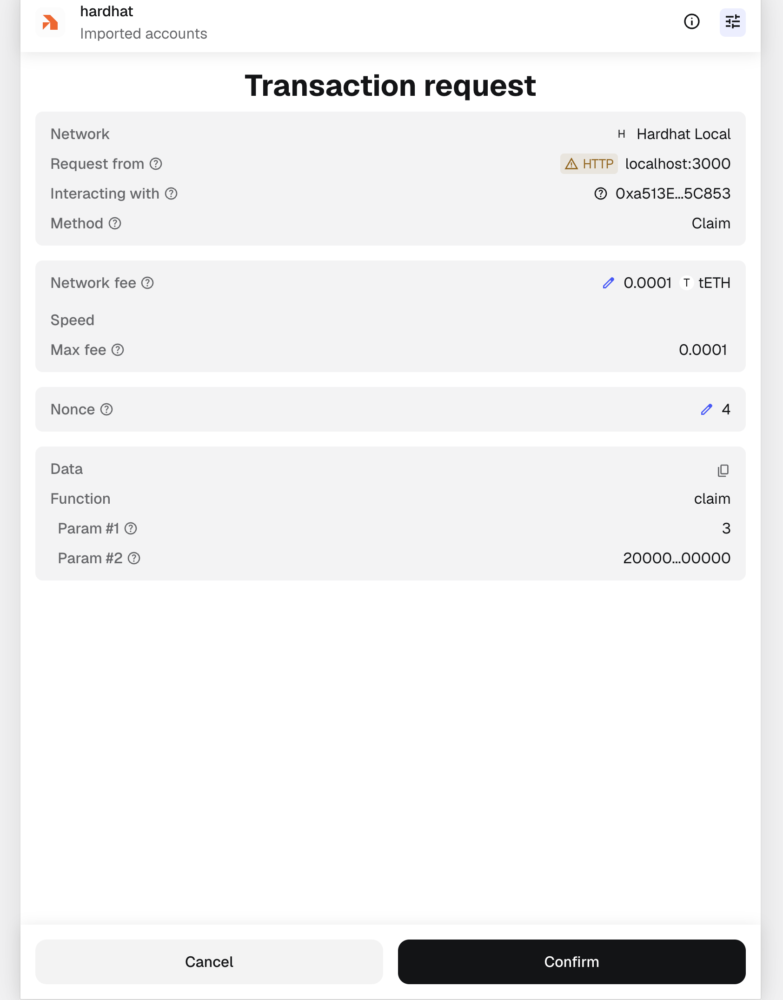

# AMMdemoPlus

A full-stack **multi-token AMM / DEX demo** built with **Hardhat, Solidity, Next.js, ethers.js, and next-intl**.

This project serves as a practical learning and demonstration environment for understanding how a decentralized exchange works across both the **smart contract layer** and the **frontend integration layer**.

---

## Screenshots

<p align="center">
  
  
  
</p>

<p align="center">
  
 
   

</p>

<p align="center">
 
</p>

## Overview

**AMMdemoPlus** is not a production-ready DEX. It is an educational and demo project designed to help developers understand:

- Liquidity pools and LP tokens
- Router / Factory / Pool architecture
- Multi-token pool design
- Swap and liquidity management workflows
- Frontend-to-contract interaction
- Local full-stack development with Hardhat + Next.js

The project is split into two main parts:

- `hardhat/` — Smart contracts, deployment scripts, and local blockchain workflows
- `web/` — Frontend UI, wallet integration, and multilingual interface

---

## Main Features

### Smart Contract Side

- **MockERC20** — Test tokens
- **LPToken** — Liquidity provider token
- **MultiTokenPool** — Core multi-token liquidity pool
- **MultiTokenRouter** — Main interaction layer
- **MultiTokenFactory** — Pool creation
- **TokenFaucet** — Claim test tokens for local development
- Helper math and library contracts

### Frontend Side

- MetaMask wallet connection
- Real-time pool and token data display
- Add / Remove liquidity flows
- Token swap functionality
- Built-in faucet dialog for insufficient balances
- Loading states and transaction overlays
- Multilingual support (English, Chinese, Japanese, French, German, Hindi)

---

## Tech Stack

**Contracts / Blockchain**

- Solidity
- Hardhat
- OpenZeppelin
- viem

**Frontend**

- Next.js
- React
- TypeScript
- Tailwind CSS
- ethers.js
- next-intl
- shadcn/ui + lucide-react

---

## Project Structure

```text
AMMdemoPlus/
├── hardhat/
│   ├── contracts/
│   │   ├── core/
│   │   ├── interfaces/
│   │   ├── libraries/
│   │   ├── periphery/
│   │   └── tokens/
│   ├── deployments/
│   ├── scripts/
│   └── test/
├── web/
│   ├── app/
│   ├── components/
│   ├── hooks/
│   ├── i18n/
│   ├── lib/
│   ├── messages/
│   └── public/
├── package.json
└── README.md
```

## Local Development

This project is designed to run locally using a Hardhat node.
Quick Start (Recommended)
Terminal 1: Start the local blockchain

```
npm run chain
```

Terminal 2: Deploy contracts and start frontend

```
npm run dev
```

This will automatically:

- Deploy all smart contracts

- Initialize the multi-token pool

- Seed test tokens

- Start the Next.js development server

## Manual Workflow

If you prefer to run each step individually:

# 1. Start Hardhat node

```
cd hardhat
npx hardhat node
```

# 2. Deploy contracts (in a new terminal)

```
npx hardhat run scripts/deployMultiTokenDex.ts --network localhost
```

# 3. Seed the pool with initial liquidity and tokens

```
npx hardhat run scripts/seedMultiTokenDex.ts --network localhost

```

# 4. Start the frontend

```
cd ../web
npm run dev

```

## Faucet

The project includes a TokenFaucet contract for convenient local testing.
When a user has insufficient token balance, the frontend will automatically open a faucet dialog allowing them to:

- Select a token

- Enter desired amount

- Claim test tokens instantly

This greatly improves the demo experience during local development.

- Internationalization

The frontend is fully localized using next-intl.
Currently supported languages:

- English

- Chinese (中文)

- Japanese (日本語)

- French (Français)

- German (Deutsch)

- Hindi (हिंदी)

Translation files are located in web/messages/.

- Current Scope & Limitations

This project is currently positioned as a **learning-focused and demonstration-oriented AMM / DEX prototype**.

It is particularly useful for:

- experimenting with AMM mechanics
- understanding smart contract architecture
- practicing full-stack Web3 development
- exploring multilingual UI / UX patterns in a blockchain application

At the same time, it is **not yet intended for production use**.
The current version does not include:

- audited pricing logic
- production-grade security hardening
- advanced slippage protection
- protocol fee and governance systems
- analytics dashboards and monitoring tools

## Possible Next Steps (Roadmap)

Potential future improvements include:

- more advanced pricing formulas, such as concentrated liquidity models
- stronger slippage and frontrunning protection
- protocol fee mechanisms
- pool analytics and visualization charts
- deployment workflows for public testnets
- richer transaction history and activity tracking
- improved mobile responsiveness
- an admin panel for faucet and pool management

## License

MIT License
